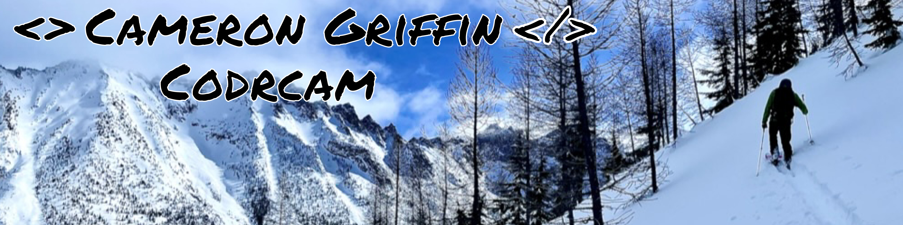

  

  <h1>Hi, I'm Cameron 👋</h1>

  

    <strong>Developer, media maker, and mountain enthusiast building at the intersection of software, storytelling, and snow science.</strong>
  

  

    
    
  

## About me

- 👨‍💻 I build web and mobile experiences with Python, JavaScript, Java, React, and Next.js.
- 🏔️ I'm especially interested in technology for the outdoors, creative media, and snow science.
- 🏎️ I built **F1 Career Bumps**, a Formula 1 data-visualization project exploring driver career trajectories.
- 🎙️ Recent work includes developing the digital home of [The Avalanche Hour](https://www.theavalanchehour.com/).
- 🤝 I'm always interested in collaborating with scientists, researchers, outdoor educators, and creative technologists.
- ❤️ Python is still my favorite language.
- 😄 Pronouns: he/him.
- 🎿 Long-term goal: ski every day for an entire winter.

## Tech stack

### Languages

### Web, APIs, and data

### Tools and platforms

## Featured projects

| Project | What it does | Built with |
| --- | --- | --- |
| **F1 Career Bumps** · Private source | An original Formula 1 data visualization exploring how driver careers evolve across seasons. | Data visualization |
| [The Avalanche Hour](https://github.com/CodrCam/TheAvalancheHourPodcast) · [Live site](https://www.theavalanchehour.com/) | A responsive podcast platform with episode search, season browsing, and Spotify integration. | Next.js, Material UI, Spotify API |
| [Mountain High](https://github.com/CodrCam/mountainhigh) | A responsive photography showcase centered on skiing, climbing, and creative work. | React, JavaScript, CSS |
| [TaskMaster](https://github.com/CodrCam/TaskMaster) | An Android task manager with local persistence and task-status tracking. | Java, Android, Room |

## Let's connect

I'm open to conversations about software, outdoor technology, scientific collaboration, media production, and ambitious mountain projects.

- [LinkedIn](https://www.linkedin.com/in/codrcam/)
- [Instagram](https://www.instagram.com/backcountrycam/)
